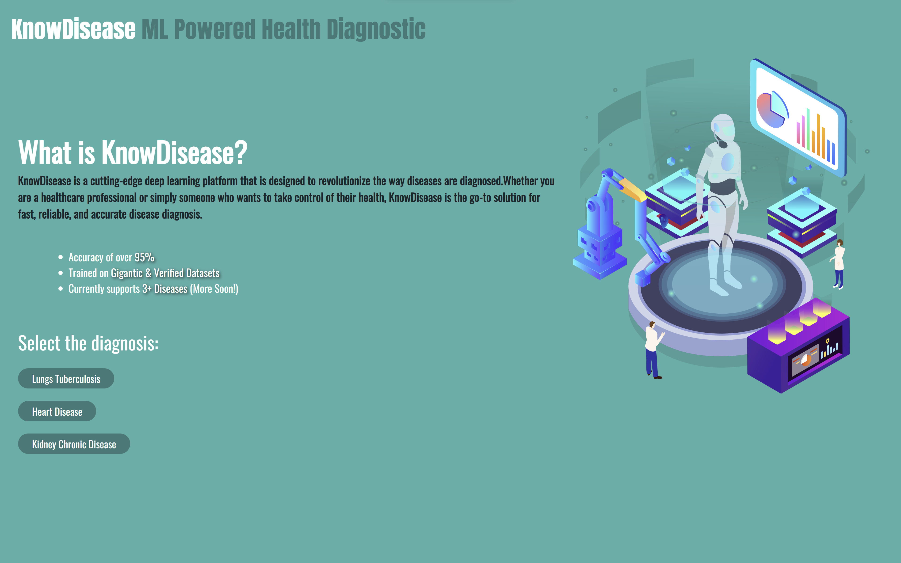
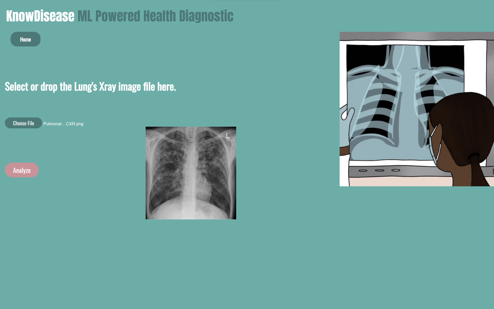

# KnowDisease - An ML Health Diagnostic 👨🏻‍⚕️

## Overview 📝
KnowDisease is an web based application that utilizes machine learning technology to diagnose lung tuberculosis by analyzing X-rays as the input. It is built on a convolutional neural network (CNN) model and relies on powerful libraries such as Flask, TensorFlow, Keras, and SciKit Learn for its backend. For the frontend, KnowDisease employs HTML, CSS, and JavaScript. The classification model used by KnowDisease has been trained on a dataset consisting of over 1000 X-ray images.

## User Interface
<p align="left">
  
</p>
<p align="center">
  
</p>

## Demo 

Here is the operational demonstration of the application.
<p align="left">
  
</p>

## Goals ✅
* Tuberculosis is a deadly disease that affects millions of people worldwide.
* Traditional methods of diagnosis are time-consuming and often unreliable.
* KnowDisease aims to provide an accurate and efficient diagnostic tool using machine learning technology to analyze X-ray images of the lungs for signs of tuberculosis.

## Technical Aspect 🧑🏻‍💻
The app is built in 3 stages.

1️⃣ The model was trained on a dataset of over 1000 lung X-rays, consisting of both infected and normal cases, using the deep learning technique, convolutional neural networks (CNN).

2️⃣The front end or user interface was developed using HTML and CSS, with a touch of JavaScript.

3️⃣The front-end and back-end gets integrated, resulting in a fully functional app that can predict the presence of tuberculosis in the lungs.

## Installation ⬇️
Firstly Clone the repository locally, then install python version 3.11.2 and download the required libraries using the following command while being in the path of cloned repo.

```bash
pip install -r requirements.txt
```
## To Do 📃
* To enhance the diagnostic capabilities of the application by incorporating support for two additional diseases, namely chronic kidney disease and heart disease.
* To establish a connection between the application and a database to improve data caching and enable efficient retraining of the model.

## Technologies Used
<p align="left" style= "padding-right:20px">
  
  
  
  
  
</p>
